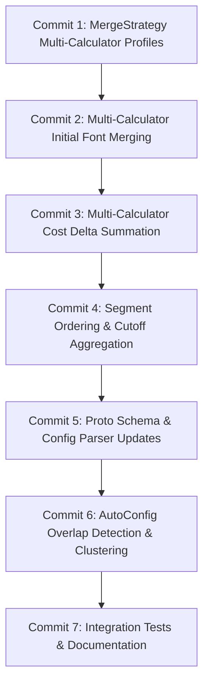

# Multi-Script and Overlapping Frequency Datasets Merging Plan

## Overview

This document outlines the detailed implementation plan for supporting overlapping Unicode frequency datasets and multi-script merging in the IFT encoder's closure glyph segmenter. This implements the design discussed in the ["Multiple Frequency Data Sets and Merge Groups"](segmenter.md#multiple-frequency-data-sets-and-merge-groups) section of `docs/segmenter.md`.

## Problem & Motivation

Fonts that support multiple languages or scripts often contain glyphs and codepoints with complex sharing patterns:
1. **Han Unification (CJK)**: Japanese, Simplified Chinese, Traditional Chinese, and Korean share thousands of unified ideographs. However, the frequency of these characters differs dramatically across languages.
2. **Shared Characters & Digits**: Scripts frequently share numbers (0–9), punctuation, or common symbols.

Previously, each `MergeStrategy` in `ClosureGlyphSegmenter` supported only a single `ProbabilityCalculator`. When multiple merge groups shared codepoints, `ClassifySegments()` categorized all shared codepoints into `shared_segments` and excluded them from merge candidate selection in all groups. For CJK fonts, this forced `AutoSegmenterConfig` to use a synthetic combined dataset (`Script_CJK.riegeli@*`), losing language-specific frequency distinctions.

## Solution Architecture & Mathematical Formulation

### 1. Multi-Calculator Total Cost Function

To treat each supported script/language with equal importance without normalizing by global language prevalence (which would unfairly penalize lower-traffic languages), the total segmentation cost is defined as the sum of costs evaluated against each frequency dataset independently:

$$\text{Cost}(S) = \sum_{m=1}^M \text{Cost}_m(S)$$

where for each probability calculator $m \in \{1, \dots, M\}$:

$$\text{Cost}_m(S) = \sum_{p_i \in S} P_m(\text{condition}(p_i)) \times (\text{size}(p_i) + k)$$

* $k$ is the `network_overhead_cost` per patch request (default 200 or 75 bytes).
* $P_m(\text{condition})$ is the activation condition probability computed by calculator $m$. If a codepoint is not present in calculator $m$'s frequency data, its probability under $m$ is $0$.

### 2. Linear Cost Delta Summation

Because the cost function is linear over the calculators, the change in cost $\Delta \text{Cost}$ resulting from any candidate merge (segment merge or patch merge) is the sum of deltas evaluated against each calculator:

$$\Delta \text{Cost} = \sum_{m=1}^M \Delta \text{Cost}_m$$

For each calculator $m$:
$$\Delta \text{Cost}_m = \sum_{c' \in \text{new}} P_m(c') \cdot (\text{size}(c') + k) - \sum_{c \in \text{modified}} P_m(c) \cdot (\text{size}(c) + k) + \Delta \text{Fallback}_m$$

Patch sizes and glyph sets are identical across calculators; only the probabilities and condition evaluations differ per calculator.

### 3. Initial Font Merging vs. Segment/Patch Merging Semantics

* **Initial Font Merging**: Evaluated **per probability calculator**. Infrequently used languages should not have their high-frequency characters forced into the initial font. Therefore, `initial_font_merge_threshold` and `initial_font_merge_probability_threshold` are configured per frequency dataset/calculator. Initial font moves evaluate candidate cost deltas against that specific calculator only.
* **Segment and Patch Merging**: Evaluated **jointly across all calculators** within the strategy. A merge is accepted if it reduces the total combined cost across all languages represented in that strategy.

---

## Incremental Implementation Steps (Commits)



---

### Commit 1: Support Multiple Probability Calculator Profiles in `MergeStrategy` (Completed)

**Status**: Completed

**Goal**: Generalize `MergeStrategy` to manage a list of probability calculator profiles rather than at most one calculator, while retaining backward-compatible convenience methods.

* **Files to modify**:
  * `ift/encoder/merge_strategy.h`
* **Changes**:
  1. Define a `ProbabilityProfile` struct:
     ```cpp
     struct ProbabilityProfile {
       std::shared_ptr<freq::ProbabilityCalculator> calculator;
       std::optional<double> init_font_merge_threshold = std::nullopt;
       std::optional<double> init_font_merge_probability_threshold = std::nullopt;

       bool operator==(const ProbabilityProfile& other) const {
         return init_font_merge_threshold == other.init_font_merge_threshold &&
                init_font_merge_probability_threshold ==
                    other.init_font_merge_probability_threshold;
       }
     };
     ```
  2. In `MergeStrategy`, replace `probability_calculator_`, `init_font_merge_threshold_`, and `init_font_merge_probability_threshold_` with `std::vector<ProbabilityProfile> probability_profiles_`.
  3. Add accessor and mutator methods:
     * `absl::Span<const ProbabilityProfile> ProbabilityProfiles() const`
     * `void AddProbabilityProfile(ProbabilityProfile profile)`
     * `bool HasInitFontMerge() const` (returns true if any profile has `init_font_merge_threshold.has_value()`)
  4. Preserve backward-compatible accessors returning primary profile data:
     * `const freq::ProbabilityCalculator* ProbabilityCalculator() const`
     * `std::optional<double> InitFontMergeThreshold() const`
     * `std::optional<double> InitFontMergeProbabilityThreshold() const`
  5. Update factories `CostBased()` and `BigramCostBased()` to populate a `ProbabilityProfile`. Update `operator==` to compare profiles.
* **Verification**:
  * Add unit tests in `ift/encoder/closure_glyph_segmenter_test.cc` or a dedicated test verifying multiple profiles, accessors, and equality.
  * Verify `bazel test -c opt //ift/encoder:...` passes.

---

### Commit 2: Multi-Calculator Initial Font Merging in `Merger` & `ClosureGlyphSegmenter` (Completed)

**Status**: Completed

**Goal**: Allow initial font merging to run per probability profile within each strategy, scoping candidate segments to those covered by each calculator.

* **Files to modify**:
  * `ift/encoder/merger.h`
  * `ift/encoder/merger.cc`
  * `ift/encoder/closure_glyph_segmenter.cc`
* **Changes**:
  1. Update `Merger::MoveSegmentsToInitFont()` to accept the profile index being processed, e.g. `MoveSegmentsToInitFont(size_t profile_index)`.
  2. Compute `inscope_segments_for_init_move_` per profile:
     * A segment is in scope for calculator $m$ if its definition has non-zero probability under `profile[m].calculator` (or intersects the calculator's covered codepoints).
  3. In `Merger::InitFontApplyProbabilityThreshold()`:
     * Use `profile[m].calculator` and check against `profile[m].init_font_merge_probability_threshold`.
  4. In `CandidateMerge::ComputeInitFontCostDelta()` and `ComputeBestCaseInitFontCostDelta()`:
     * Compute cost delta using `profile[m].calculator`. Compare delta against `*profile[m].init_font_merge_threshold`.
  5. In `ClosureGlyphSegmenter::CodepointToGlyphSegments()`:
     * Iterate over each merger, and for each merger, iterate over each profile where `profile.init_font_merge_threshold.has_value()`.
     * Reassign initial subsets across all mergers after moves are applied.
* **Verification**:
  * Unit test in `closure_glyph_segmenter_test.cc`: Configure a strategy with 2 mock calculators: Calculator 1 has `init_font_merge_threshold = -100` for codepoints {'A', 'B'}; Calculator 2 has no threshold set for {'B', 'C'}. Verify only 'A' and 'B' move to the initial font.
  * Run `bazel test -c opt //ift/encoder:closure_glyph_segmenter_test`.

---

### Commit 3: Multi-Calculator Cost Delta Summation in `CandidateMerge` (Completed)

**Status**: Completed

**Goal**: Calculate cost deltas as the sum of deltas evaluated across all probability calculators in the strategy.

* **Files to modify**:
  * `ift/encoder/candidate_merge.h`
  * `ift/encoder/candidate_merge.cc`
* **Changes**:
  1. In `CandidateMerge::ComputeCostDelta<best_case>()`:
     * For each profile in `merger.Strategy().ProbabilityProfiles()`:
       * Evaluate removed patch costs: $\sum_{c} P_m(c) \cdot (\text{size}(c) + k)$.
       * Evaluate new condition merged probabilities: $P_m(c') = c'\text{.MergedProbability}(\dots, *profile.calculator)$.
       * Evaluate new patch costs: $\sum_{c'} P_m(c') \cdot (\text{size}(c') + k)$.
       * Add fallback patch delta for calculator $m$: $1.0 \times \Delta \text{fallback\_size}$.
       * Accumulate $\Delta \text{Cost} += \Delta \text{Cost}_m$.
     * Support `best_case` mode by summing best-case estimated reductions across all calculators.
  2. In `CandidateMerge::PatchMergeDetails::ComputePatchMergeCostDelta<best_case>()`:
     * Loop over all profiles $m$:
       $$\Delta \text{Cost}_m = P_m(a \lor b) \cdot (\text{size}_{a \lor b} + k) - P_m(a) \cdot (\text{size}_a + k) - P_m(b) \cdot (\text{size}_b + k)$$
     * Sum deltas across all profiles: $\Delta \text{Cost} = \sum_{m=1}^M \Delta \text{Cost}_m$.
* **Implementation note**: Patch sizes and glyph sets are identical for all
  calculators, only the probabilities differ. Since the cost function is linear
  in the probabilities the per calculator deltas are summed by evaluating each
  patch cost with the *aggregate probability* of its activation condition
  ($\sum_m P_m(c)$), which avoids recomputing patch sizes once per calculator.
  This is implemented by the `AggregateProbability()` and
  `AggregateMergedProbability()` helpers in `candidate_merge.cc`. The fallback
  patch is needed with probability 1.0 under every calculator, so its size
  delta is multiplied by the number of profiles.
* **Verification**:
  * Unit tests in `ift/encoder/candidate_merge_test.cc`: Evaluate segment and patch merge deltas with two mock calculators with known probabilities. Verify total delta matches the exact expected sum.
  * Run `bazel test -c opt //ift/encoder:candidate_merge_test`.

---

### Commit 4: Segment Ordering, Candidate Selection & Optimization Cutoff Aggregation (Completed)

**Status**: Completed

**Goal**: Update segment ordering, candidate collections, inert pruning, and optimization cutoff to account for all probability calculators in a strategy.

* **Files to modify**:
  * `ift/encoder/closure_glyph_segmenter.cc`
  * `ift/encoder/merger.h`
  * `ift/encoder/merger.cc`
  * `ift/encoder/candidate_merge.cc`
* **Changes**:
  1. **Global Segment Ordering**:
     * For a segment $s$, its combined probability weight across the strategy is:
       $$P_{\text{agg}}(s) = \sum_{m=1}^M P_m(s)$$
     * Global segment ordering is based in part on `ComputeSegmentProbabilities()`.
     * In `ComputeSegmentProbabilities()`: assigns a single probability to each segment derived from all strategies.
       This should be updated to computed the average probability across all calculators for each strategy,
       and then pick the largest average probability when combining across strategies.
  2. **Optimization Cutoff**:
     * In `Merger::ComputeSegmentCutoff()`:
       * Cost contribution of segment $s$ is $P_{\text{agg}}(s) \times (\text{size}(s) + k)$.
       * Calculate total cost as $\sum_{s} P_{\text{agg}}(s) \times (\text{size}(s) + k)$.
       * Prune tail segments using $P_{\text{agg}}$ until cutoff threshold is reached.
  3. **Inert Candidate Pruning**:
     * In `Merger::BestCaseInertProbabilityThreshold()`: Use $P_{\text{agg}}(\text{base})$ and $P_{\text{agg}}(\text{other})$ to compute threshold and skip candidates.
  4. **Patch Merge Candidate Ordering**:
     * In `Merger::TryNextPatchMerge()`: Sort composite conditions by aggregate probability $\sum_m P_m(\text{condition})$ descending.
* **Implementation note**: The aggregate probability helpers introduced in
  commit 3 were moved from `candidate_merge.cc` onto `Merger`
  (`AggregateProbability()`, `AggregateMergedProbability()` and
  `MaxAggregateProbability()`) so that both cost delta computation and
  candidate selection share a single definition. Note that an aggregate
  probability ranges over $[0, M]$ rather than $[0, 1]$, so the clamp in
  `BestCaseInertProbabilityThreshold()` was changed from `1.0` to
  `MaxAggregateProbability()`.

  `ComputeSegmentProbabilities()` is the one exception: it *averages* rather
  than sums across a strategy's calculators. Its output is compared against
  `PreClosureProbabilityThreshold()` and against the probabilities of segments
  from other strategies, so it must stay in $[0, 1]$ and must not scale with
  the number of calculators in a strategy.
* **Verification**:
  * Unit tests in `closure_glyph_segmenter_test.cc`: Verify segment ordering prioritizes codepoints with high frequency in any calculator over tail codepoints with low frequency in all calculators.
  * Run `bazel test -c opt //ift/encoder:closure_glyph_segmenter_test`.
  * Note: the inert candidate pruning change (item 3) is a soundness fix for an
    optimization and has no observable effect on the resulting segmentation. A
    candidate with a low probability under the first calculator but a high
    aggregate probability is always a cross calculator merge, which is rejected
    on cost grounds anyway. It is therefore covered indirectly by
    `MultipleProfiles_MergesWithinEachCalculator`.

---

### Commit 5: Update `segmenter_config.proto` & Parser for Multiple Frequency Datasets (Completed)

**Status**: Completed

**Goal**: Support multiple frequency dataset definitions per `MergeGroup` / `CostConfiguration` in protobuf, and parse them into multi-profile `MergeStrategy` instances.

* **Files to modify**:
  * `ift/config/segmenter_config.proto`
  * `ift/config/segmenter_config_util.h`
  * `ift/config/segmenter_config_util.cc`
* **Changes**:
  1. Update protobuf schema:
     ```protobuf
     message FrequencyDataConfig {
       oneof freq_data {
         string path_to_frequency_data = 1;
         string built_in_freq_data_name = 2;
       }
       bool use_bigrams = 3 [default = false];
       double initial_font_merge_threshold = 4;
       double initial_font_merge_probability_threshold = 5;
     }

     message CostConfiguration {
       repeated FrequencyDataConfig frequency_data = 11;

       // Legacy single-dataset fields retained for backward compatibility:
       oneof freq_data {
         string path_to_frequency_data = 1 [deprecated = true];
         string built_in_freq_data_name = 2 [deprecated = true];
       }
       bool use_bigrams = 3 [default = false, deprecated = true];
       double initial_font_merge_threshold = 7 [deprecated = true];
       double initial_font_merge_probability_threshold = 8 [deprecated = true];

       uint32 network_overhead_cost = 4 [default = 75];
       uint32 min_group_size = 5 [default = 1];
       double optimization_cutoff_fraction = 6 [default = 0.001];
       double best_case_size_reduction_fraction = 9 [default = 0.5];
       bool experimental_use_patch_merges = 10 [default = false];
     }
     ```
  2. In `SegmenterConfigUtil::ProtoToCostStrategy()`:
     * If `config.frequency_data()` is non-empty, iterate over each `FrequencyDataConfig`, instantiate `UnigramProbabilityCalculator` or `BigramProbabilityCalculator`, populate a `ProbabilityProfile`, and add to the `MergeStrategy`.
     * If empty, fallback to legacy fields (1, 2, 3, 7, 8).
     * Set `covered_codepoints` to the union of all datasets in the group.
  3. In `SegmenterConfigUtil::ProtoToMergeGroup()`:
     * When `segment_ids` is not specified, map segments intersecting the union of `covered_codepoints`.
* **Implementation notes**:
  * `frequency_data` is the one field on `CostConfiguration` which is *not*
    merged with the base cost config. `MergeFrom()` concatenates repeated
    fields, which would silently add the base config's datasets to every group,
    so when a merge group specifies any datasets they fully replace the base
    config's. Otherwise the base config's datasets are inherited as usual.
  * The legacy fields are translated into an equivalent single
    `FrequencyDataConfig` (`LegacyFrequencyDataConfig()` in
    `segmenter_config_util.cc`) so there is only one code path for building
    probability profiles. Specifying both the legacy freq data fields and
    `frequency_data` is rejected with `InvalidArgumentError` rather than
    silently ignoring one of them.
  * Since the legacy fields are now marked `deprecated = true`, the few places
    which intentionally still read/write them (the legacy conversion helpers
    and the backward compatibility tests) suppress
    `-Wdeprecated-declarations` locally. `auto_segmenter_config.cc` continues to
    write the legacy fields until commit 6.
  * A second frequency dataset (`util/testdata/test_freq_data_2.riegeli`,
    covering 0x45 and 0x47 vs. 0x43/0x44 in `test_freq_data.riegeli`) was added
    so tests can verify covered codepoints are unioned across datasets. It's
    generated by
    `bazel run //util:generate_riegeli_test_data -- --alternate_data --output_path=<path>`.
* **Verification**:
  * Unit tests in `ift/config/segmenter_config_util_test.cc`:
    * `ConfigToMergeGroups_MultipleFrequencyData`: multiple `frequency_data`
      entries produce one profile each, with per dataset init font thresholds
      and `use_bigrams`, and segments inferred from the union of covered
      codepoints.
    * `ConfigToMergeGroups_FrequencyDataOverridesBaseConfig` /
      `ConfigToMergeGroups_FrequencyDataFromBaseConfig`: base config merge
      semantics.
    * `ConfigToMergeGroups_LegacyFreqDataFields` /
      `ConfigToMergeGroups_LegacyAndFrequencyDataIsInvalid`: backward
      compatibility and mixed config rejection.
  * Run `bazel test -c opt //ift/config:segmenter_config_util_test`.

---

### Commit 6: Update `AutoSegmenterConfig` to Detect Overlaps and Group Scripts (Completed)

**Status**: Completed

**Goal**: Automatically detect script overlaps in a font and cluster overlapping scripts into unified merge groups, eliminating the synthetic `Script_CJK.riegeli@*` workaround.

* **Files to modify**:
  * `ift/config/auto_segmenter_config.cc`
  * `ift/config/auto_segmenter_config_test.cc`
* **Changes**:
  1. Remove the legacy code in `DetectScripts()` that forced individual CJK scripts into `Script_CJK.riegeli@*`.
  2. For each detected script $S_i$, find font-intersecting codepoints:
     $$C(S_i) = \text{FreqCodepoints}(S_i) \cap \text{FontUnicodes}$$
  3. Detect overlaps between scripts:
     * Two scripts $S_i$ and $S_j$ overlap if $(C(S_i) \setminus \text{Common}) \cap (C(S_j) \setminus \text{Common}) \neq \emptyset$, where $\text{Common}$ are universal common codepoints (ASCII / punctuation).
  4. Find connected components of overlapping scripts using BFS or Disjoint Set Union (DSU).
  5. For each component:
     * Generate a single `MergeGroup`.
     * Add a `FrequencyDataConfig` for each script in the component.
     * If `primary_script` is present in the component, set `initial_font_merge_threshold` ONLY on that script's `FrequencyDataConfig`.
  6. In `ApplyQualityLevelTo()`: Apply quality settings (`use_bigrams`, `initial_font_merge_probability_threshold`, etc.) across all `FrequencyDataConfig` items in each merge group.
* **Verification**:
  * Update tests in `ift/config/auto_segmenter_config_test.cc`:
    * Verify `NotoSansJP-Regular.ttf` produces a single unified merge group containing both Japanese and Chinese frequency datasets instead of `Script_CJK.riegeli@*`.
    * Verify `primary_script = "Script_japanese"` sets `initial_font_merge_threshold` only for Japanese.
    * Verify disjoint scripts (e.g. Latin and Arabic) remain in separate `MergeGroup`s.
  * Run `bazel test -c opt //ift/config:auto_segmenter_config_test`.

**Implementation notes**:

* Script detection ignores the synthetic `Script_CJK.riegeli@*` data set (it's
  only used when explicitly selected as the primary script) and detects each
  CJK script individually. To do that the set of "common" codepoints which
  detection subtracts (codepoints which appear in two or more script data sets)
  is computed over the *non CJK* scripts only: the CJK scripts share nearly all
  of their codepoints with each other, so including them would leave each
  individual CJK script with almost nothing unique and none of them would be
  detected.
* The overlap criterion (step 3) deviates from the plan. A "shares at least one
  non-common codepoint" test chains nearly every script into one giant group:
  in practice almost all pairs of data sets share `U+0020` and `U+00A0`, emoji
  and CJK share `U+3030`, `U+303D`, `U+3297`, `U+3299`, and emoji and latin
  share `U+0023`, `U+002A`, `U+0030`-`U+0039`, `U+00A9`, `U+00AE`, `U+2122`.
  Instead two filters are applied:
  1. Codepoints whose Unicode general category is a space separator, a format
     character or a control character, plus combining marks in
     `U+0300`-`U+0400`, are excluded from overlap consideration entirely.
     These appear in nearly every data set and say nothing about script
     relatedness.
  2. The remaining shared codepoints are weighted by probability mass rather
     than counted. For scripts $A$ and $B$ with shared codepoints
     $S = C(A) \cap C(B)$, the overlap is
     $$\max\left(\frac{\sum_{cp \in S} P_A(cp)}{\sum_{cp \in C(A)} P_A(cp)},
     \frac{\sum_{cp \in S} P_B(cp)}{\sum_{cp \in C(B)} P_B(cp)}\right)$$
     and the scripts are grouped when this is `>= 0.1`. Weighting by
     probability is what matters in practice: the shared codepoints of two
     scripts left in separate merge groups fall back to heuristic merging, so
     grouping is important exactly when the shared codepoints carry a lot of
     probability mass (eg. emoji and latin, where emoji's handful of shared
     ASCII codepoints carry almost all of its probability mass) and
     unimportant when they carry very little (eg. emoji and CJK).
* Measured values for `NotoSansJP-Regular.ttf` are strongly separated. The CJK
  pairs all score above 0.98 (zh-Hans/zh-Hant 0.99995, zh-Hans/ja 0.99976,
  zh-Hans/ko 0.99269, zh-Hant/ja 0.99944, zh-Hant/ko 0.98986, ja/ko 0.99883)
  and emoji/latin scores 0.99541 on only 15 shared codepoints, while
  emoji/CJK scores 7e-05 (on 4 shared codepoints) and is rejected.
  emoji/symbols sits in between at 0.14812, above the 0.1 threshold, so the
  font's emoji, latin and symbols end up in a single merge group. For
  `Roboto-Regular.ttf` no pair of detected scripts shares a single
  non-excluded codepoint, so no frequency data is loaded at all and every
  script stays in its own merge group.
* Computing the weights requires real frequency data, but only the unigram
  counts are needed. Rather than loading (and discarding the bigrams of) the
  full data sets, the weights are computed from the prebuilt unigram only
  copies of the data sets in `data/unigram/` of the `ift-encoder-data`
  repository (see https://github.com/w3c/ift-encoder-data/pull/9), reached via
  the new `DataFileResolver::GetUnigramFrequencyDataDirectory()` and
  `LoadBuiltInUnigramFrequencies()`. These files are never sharded, so a
  trailing `@*` on a data set name is stripped before opening them.
  Additionally frequency data is only loaded for scripts which share at least
  one (non-excluded) codepoint with another script. Together these keep the
  cost of auto config generation negligible, even for CJK fonts
  (`//ift/config:auto_segmenter_config_test` remains `size = "small"` and runs
  in under a second).
* `ApplyPrimaryScript()` no longer collapses all CJK scripts when the primary
  is a CJK language/script; it only does so when the primary is the synthetic
  `Script_CJK.riegeli@*` data set (which is otherwise never auto detected).
  So `primary_script = "Script_japanese"` keeps japanese grouped with the
  other CJK scripts and only sets the initial font merge threshold on the
  japanese data set.
* `use_bigrams` and `initial_font_merge_probability_threshold` are now set per
  `FrequencyDataConfig` rather than on the (deprecated) `CostConfiguration`
  fields, which also removes the last deprecation warnings in the build.
* Merge group names are the `+` joined script names of the group, in the same
  (sorted) order as the frequency data sets, eg. `Latin+Symbols` or
  `Chinese-simplified+Chinese-traditional+Japanese+Korean`.

---

### Commit 7: End-to-End Integration Tests & Documentation

**Goal**: Verify complete pipeline on real multi-script fonts and finalize documentation.

* **Files to modify**:
  * `ift/encoder/closure_glyph_segmenter_test.cc` or `ift/integration_test.cc`
  * `docs/segmenter.md`
  * `docs/multi_script_merging.md`
* **Changes**:
  1. Add an integration test using a CJK font (e.g. `NotoSansJP-Regular.ttf`) configured with separate Japanese and Chinese frequency datasets in a single strategy:
     * Verify `CodepointToGlyphSegments()` meets the closure requirement (`ValidateIncrementalGroupings` passes).
     * Verify that patches with shared Han ideographs are formed and merged effectively.
     * Verify initial font contains high-probability primary script characters.
  2. Update `docs/segmenter.md`:
     * Update the "Multiple Frequency Data Sets and Merge Groups" section to describe the completed multi-calculator implementation.
  3. Mark `docs/multi_script_merging.md` as completed.
* **Verification**:
  * Run complete repository test suite:
    ```sh
    bazel test -c opt ...
    ```
